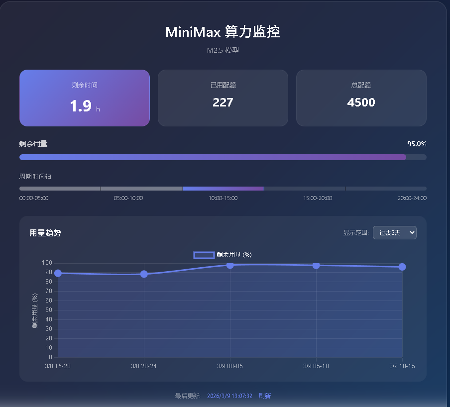

# MiniMax 算力监控工具

实时监控 MiniMax API 用量，自动记录历史数据。

## 效果展示

**在线演示**：https://wandaydd.com/minimax



---

## 架构

本项目支持两种使用方式：

| 模式 | 数据存储 | 访问方式 | 适用场景 |
|------|----------|----------|----------|
| **本地版** | 本地文件 | 局域网访问 | 个人使用、无需部署 |
| **远程版** | 腾讯云 COS | 任意设备访问 | 随时随地查看 |

## 安装

```bash
pip install -r requirements.txt
```

## 配置

编辑 `config.yaml` 文件：

```yaml
# MiniMax API 配置（必填）
api_key: "your-api-key-here"

# API 地址（通常不需要修改）
api_url: "https://www.minimaxi.com/v1/api/openplatform/coding_plan/remains"

# 监控配置
monitor:
  interval_minutes: 30      # 检查间隔（分钟）
  record_before_seconds: 300 # 周期结束前多少秒额外记录
  cycle_hours: 5            # 算力周期（小时）

# 远程部署配置（本地版不需要修改）
remote:
  cloud_function_url: "https://xxx.tencentscf.com/release"
  cos_url: "https://xxx.cos.ap-shanghai.myqcloud.com/usage_data.json"
```

---

## 本地版使用

### 方式一：命令行查询

```bash
# 查询当前用量
python local/monitor.py query

# 启动定时监控（后台运行）
python local/monitor.py monitor

# 查看历史记录
python local/monitor.py history
```

### 方式二：Web 界面

1. 启动定时记录（必需）：
   ```bash
   python local/monitor.py monitor
   ```

2. 启动 HTTP 服务器（新开终端）：
   ```bash
   python local/server.py
   ```

3. 浏览器访问：`http://localhost:8080/local/index_local.html`

---

## 远程版使用

远程版需要部署到腾讯云。

### 部署步骤

1. **云函数代码**：使用云函数版本的代码（获取 API Key 从环境变量）

2. **同步配置**：将 `config.yaml` 中的 `remote` 配置项复制到 `remote/index.html` 中

3. **上传前端**：将 `remote/index.html` 上传到 COS 桶

4. **访问**：通过 COS 桶的访问地址访问

---

## 项目结构

```
.
├── config.yaml          # 配置文件（所有配置）
├── requirements.txt    # Python依赖
├── usage_data.json     # 历史数据（自动生成）
│
├── local/              # 本地版本
│   ├── monitor.py     # 定时记录脚本
│   ├── server.py      # HTTP服务器
│   └── index_local.html
│
└── remote/             # 远程版本（部署到COS）
    └── index.html
```

---

## API 接口

本地服务器提供以下接口：

| 接口 | 说明 |
|------|------|
| `/api/current` | 获取实时用量数据 |
| `/api/history` | 获取历史记录 |
| `/api/config` | 获取远程配置信息 |

---

## 温馨提示

**关于 MiniMax API 字段命名**：经测试发现，MiniMax 返回的字段名称可能存在语义混淆（如 `used_count` 和 `remain_count` 的实际含义可能与字面意思相反）。如果你让 AI 自动修改相关代码，请注意这一点，建议通过实际测试验证字段含义后再使用。
